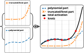
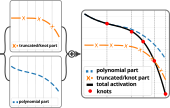
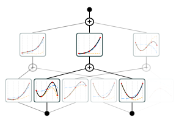
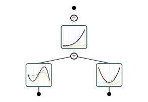

# trukan

**TruKAN** is a Python package implementing a novel, efficient variation of Kolmogorov-Arnold Networks (KANs). It replaces the B-spline basis with truncated power functions derived from k-order spline theory, better interpretability, and strong performance on real-world tasks.

> **Important Notice**: The complete source code of the `trukan` package will be fully open-sourced on this repository **after the corresponding research paper is accepted by a peer-reviewed journal**.  

## Table of Contents
- [About TruKAN](#about-trukan)
- [Generic Plotter & Pruner](#generic-plotter--pruner)
- [Installation](#installation)
- [License](#license)

## About TruKAN

TruKAN preserves the canonical KAN topology and learnable univariate activations but replaces the computationally heavy B-spline basis with a family of **truncated power functions** `(x - t_j)_+^k` combined with a low-order polynomial term. This design maintains full expressiveness while improved the performance.

Key advantages demonstrated in the paper:
- **Efficiency**: Lower GPU memory compared to standard KAN (pykan) and some other variants.
- **Interpretability**: Explicit decomposition into polynomial + truncated-power terms makes learned functions easy to analyze and visualize.
- **Flexibility**: Supports both shared knots (more efficient) and individual knots (more expressive).
- **Performance**: Outperforms MLP, standard KAN, and SineKAN on CIFAR-10/100, STL-10, and Oxford-IIIT Pets when integrated into an EfficientNet-V2 backbone.

**Paper**: [TruKAN: Towards More Efficient Kolmogorov-Arnold Networks Using Truncated Power Functions](https://arxiv.org/abs/2602.03879)  
**Authors**: Ali Bayeh, Samira Sadaoui, Malek Mouhoub  
**arXiv**: 2602.03879 (February 2026)

**TruKAN Layer Structure**  
<table align="center">
  <tr>
    <td align="center">
       
      (a) Fixed-knot version (equal intervals)
    </td>
    <td align="center">
       
      (b) Learnable-knot version (trainable knot positions with ordering constraints)
    </td>
  </tr>
</table>

**Learned Activations**  
<table align="center">
  <tr>
    <td align="center">
       
      (a) Trained TruKAN
    </td>
    <td align="center">
       
      (b) Pruned TruKAN
    </td>
  </tr>
</table>

## Generic Plotter & Pruner

One of the major contributions of the `trukan` package is its **generic, extensible plotting** — a clear improvement over the original `pykan` implementation.

### Why it is more generic
- **trukan** tools work with *any* KAN-style model that follows a minimal interface:
  - Consistent naming convention.
  - Implementation of a single method that returns the numerical activation functions.

### How it works
Any compatible KAN variation can be plotted automatically. No forking or rewriting of visualization code is required.

## License

`trukan` is distributed under the terms of the [MIT](https://spdx.org/licenses/MIT.html) license.
